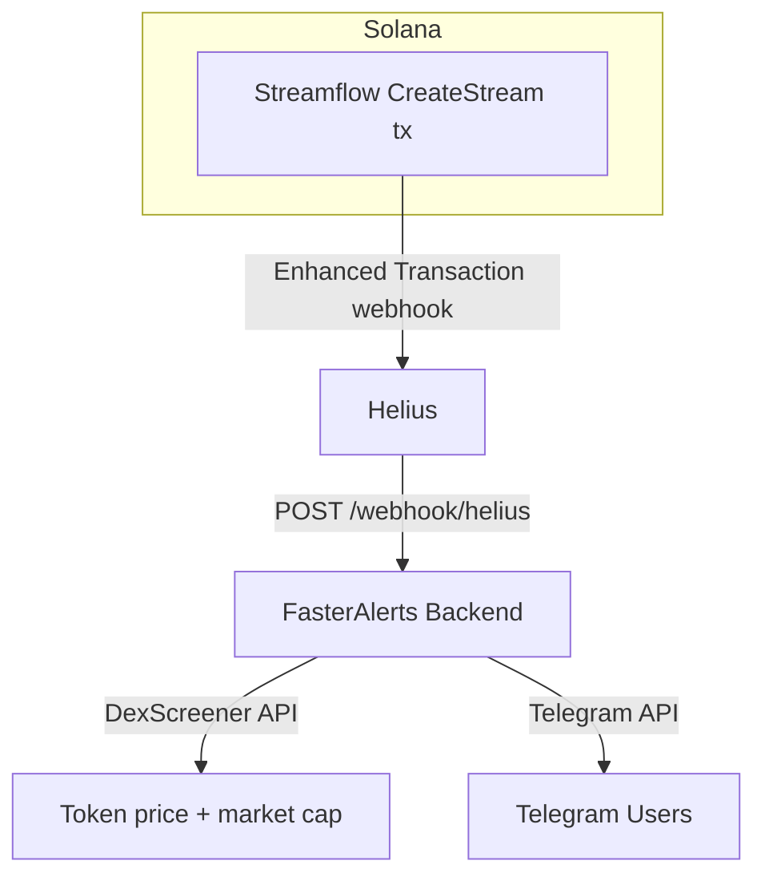

# FasterAlerts

Real-time Telegram alerts the moment a new Streamflow vesting lock is created on Solana.

## Architecture



## How It Works

When someone creates a Streamflow vesting stream on Solana, Helius detects the transaction and POSTs the full enhanced transaction payload to this server. FasterAlerts:

1. Detects the Streamflow program instruction and identifies it as a stream creation
2. Borsh-decodes the instruction data to extract cliff timestamp and vesting duration
3. Calls DexScreener to get token name, symbol, price, and market cap
4. Sends a formatted alert to all configured Telegram chat IDs

## Prerequisites

- **.NET 8.0 SDK**
- A **Helius** account with an enhanced transaction webhook pointed at `http://your-ip:<YOUR_PORT>/webhook/helius`
- A **Telegram bot** token from [@BotFather](https://t.me/BotFather)

## Setup

### 1. Configure Secrets

The app reads from `appsettings.json` (safe defaults, committed) and `dotnet user-secrets` (real keys, never committed).

Run these in `FasterAlerts/`:

```cmd
dotnet user-secrets set "Telegram:BotToken" "YOUR_BOT_TOKEN"
dotnet user-secrets set "Telegram:CommaSeperatedChatIds" "CHAT_ID_1,CHAT_ID_2"
dotnet user-secrets set "Helius:ApiKey" "YOUR_HELIUS_API_KEY"
```

To find a user's chat ID — have them message your bot, then call:
```
GET https://api.telegram.org/bot{TOKEN}/getUpdates
```

### 2. Configure Port

Edit `FasterAlerts/appsettings.json`:

```json
{
  "HeliusWebhookCallbackPort": <YOUR_PORT>
}
```

Make sure this port is open inbound on your machine's firewall.

### 3. Register Helius Webhook

In the Helius dashboard, create an **Enhanced Transaction** webhook:
- URL: `http://your-public-ip:<YOUR_PORT>/webhook/helius`
- Watch program IDs:
  - `strmRqUCoQUgGUan5YhzUZa6KqdzwX5L6FpUxfmKg5m`
  - `aSTRM2NKoKxNnkmLWk9sz3k74gKBk9t7bpPrTGxMszH`

### 4. Run

```cmd
cd FasterAlerts
dotnet run
```

Should show:
```
[yyyy-MM-dd HH:mm:ss] Now listening on: http://0.0.0.0:{HeliusWebhookCallbackPort}
```

## Alert Format

```
🔒 12.4% of $SYMBOL ($1.20m MC) LOCKED
📝 Contract: {mint address}
⏰ For: 2mo 28d | Until Aug 18, 2026 14:30 UTC
🔗 Solscan | Streamflow
```
